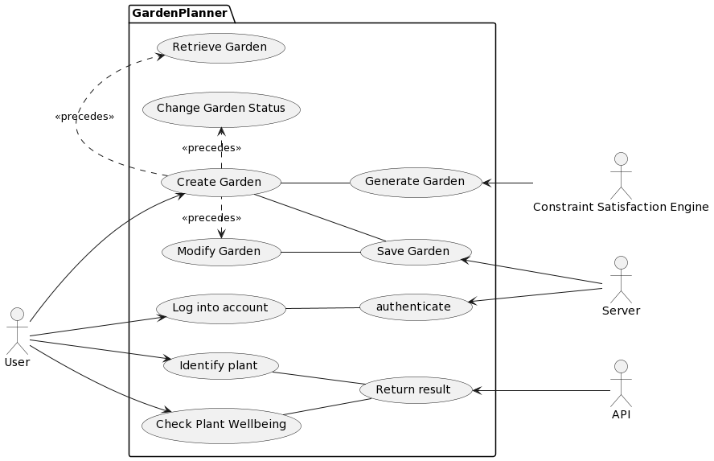
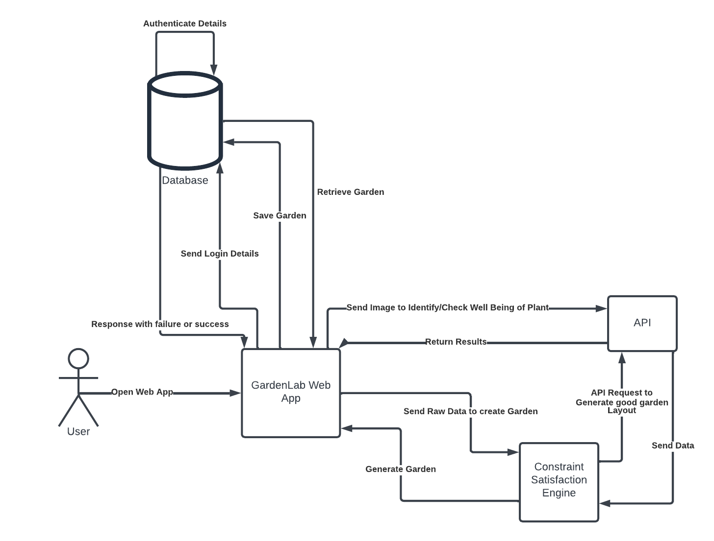
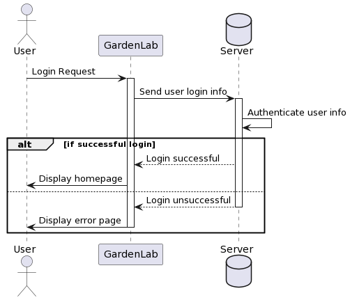
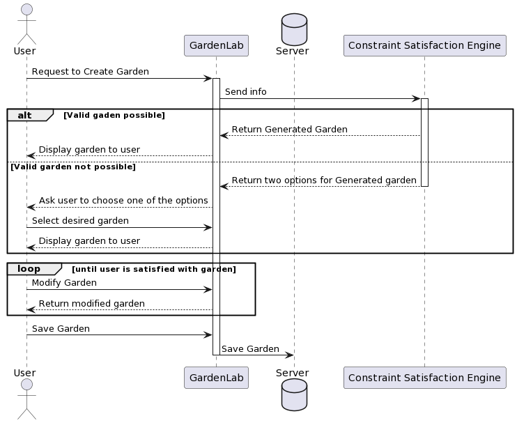
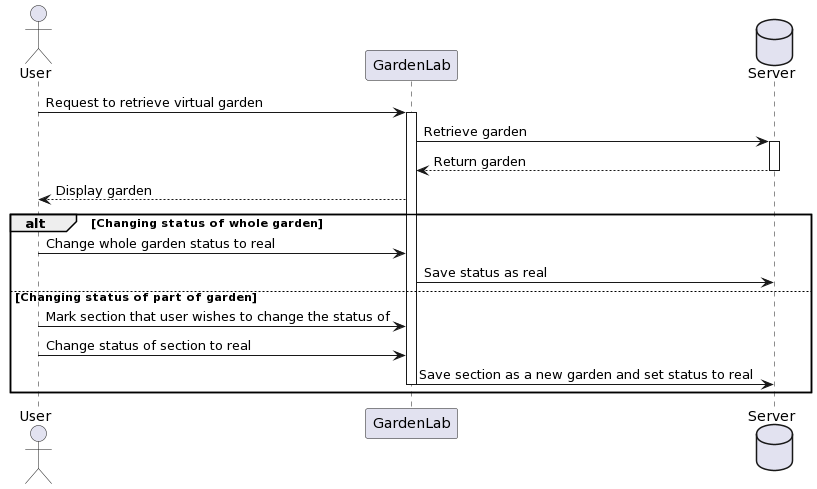
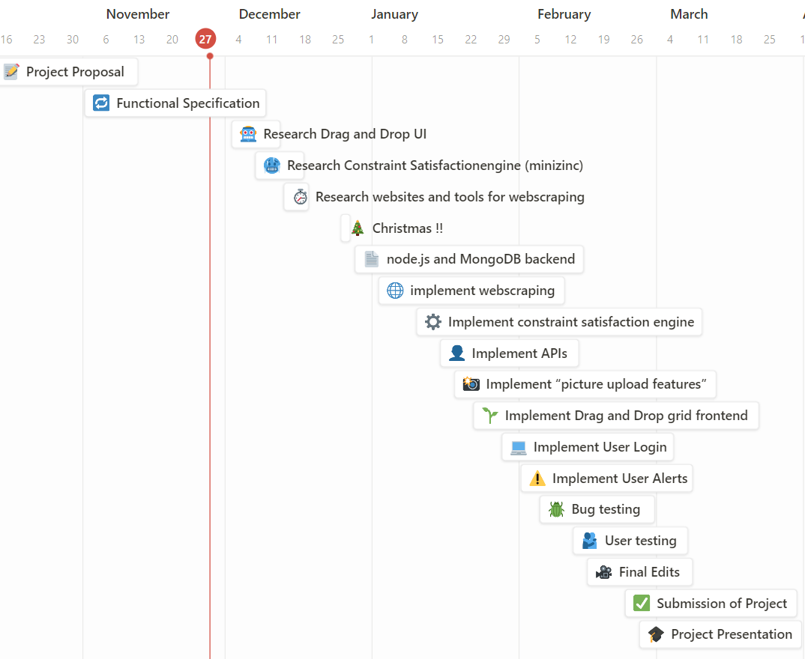

# 0. Table of contents

[**1. Introduction **](#intro)

[1.1 Overview](#overview)

[1.2 Business Context ](#business)

[1.3 Glossary](#glossary)

[**2. General Description **](#gd)

[2.1 Product / System Functions ](#product)

[2.2 User Characteristics and Objectives](#usercharacteristics)

[2.3 Operational Scenarios](#ops)

[2.4 Constraints ](#constraints)

[**3. Functional Requirements **](#functional)

[3.1 Login](#login)

[3.2 Virtual Garden Planner](#virtualgarden)

[3.3 Plant Compatibility](#compatibility)

[3.4 Plant Positioning ](#shadescore)

[3.5 Plant Identifier ](#plantid)

[3.6 Plant well-being](#plantwell)

[3.7 Weather and Disease Alerts ](#disease)

[**4. System Architecture **](#systemarc)

[4.1 System architecture Diagram ](#sysarc)

[**5. High-Level Design **](#highlevel)

[5.1 Sequence diagram for logging in ](#sequence)

[5.2 Sequence diagram for Creating a Virtual Garden](#sequencegarden)

[5.3 Sequence Diagram for Changing Garden State from Virtual to Real](#real)

[**6. Preliminary Schedule **](#prelim)

[**7. Appendices **](#end)

#


#


# 1. Introduction <a name="introduction"></a>

## 1.1 Overview <a name="overview"></a>

The goal of this software specification requirements document is to offer a detailed description of all of the features that will be implemented in the system and to define the expectations for the garden planner. In addition, it explains how the system will work and how users will interact with the garden planner through the web app. The features of this app as detailed in section 2.1, are uniquely combined into a comprehensive app that can help users obtain the best from their garden from the planning phase to the monitoring mode and intervention recommendations.

## 1.2 Business Context <a name="business"></a>

N/A as is freely accessible to users.

List of similar apps:

[https://www.gardeners.com/how-to/garden-planner/garden-designer.html](https://www.gardeners.com/how-to/garden-planner/garden-designer.html), has a drag and drop feature onto the grid similar to how we want our web app to be; however it does not implement any plant compatibility feature like how we want for our planner. Users cannot block out unplantable areas of the grid or shaded areas on this web app, our app will implement these unique features.

[https://my-garden.gardena.com/uk](https://my-garden.gardena.com/uk) This app has furniture and plant irrigation planning, i.e. sprinklers, which our app won't have. This planning grid doesn't have a plant compatibility feature and more so focuses on overall garden layout while our app focuses on plant health.

[http://www.gardenplanpro.com/](http://www.gardenplanpro.com/), This app does have a compatibility feature but it is static, simply a list of companion plants for each plant. Not based on a score by dragging two plants together like our app. This app does have a similar weather feature to our app, with location specific to the user to optimise garden productivity.

[https://plantidentifier.info/](https://plantidentifier.info/) Plant identifier app, user takes photo and app returns the species name with other information such as suitable soil, toxicity and watering requirements. This is the only feature this app offers while our app will include a photo identification tool as well as a garden planner all in one.

## 1.3 Glossary <a name="glossary"></a>

sortable.js  - A javascript library that allows you to sort lists by dragging and dropping list items.
UI  - User interface, the components the user interacts with including the grid.
node.js  - A javascript environment used to build our application.
Constraint satisfaction engine  - A constraint satisfaction engine is a computational tool that efficiently finds solutions to constraint satisfaction problems by exploring and narrowing down possible combinations of variable assignments based on specified constraints.
minizinc  - A constraint satisfaction engine. 
selenium  - Web scraping tool that can be used with python.

# 2. General Description <a name="gd"></a>

## 2.1 Product / System Functions <a name="product"></a>

The system will enable a user to generate an optimal garden layout, by arranging user-selected plants, adding compatible plants and removing incompatible plants. The garden layout can be modified by the user using drag and drop. We have a garden compatibility score to make sure that the garden remains optimal despite the changes. The user can create an account so the garden plant layout and user information can be saved. This takes the users mapped out garden from "virtual" to "real" and the users information is stored for a fixed period in the systems database. This allows the system to be able to deliver accurate alerts if there is a disease outbreak or adverse weather conditions relevant to the user.

The system's goal is to achieve optimal garden health for the user, in order to achieve this it combines the following features:

- The system advises on plant compatibility
- The system provides a layout of compatible combinations of plants among a list of plants suggested by the user. If some areas are empty, the app can suggest compatible plants if the user asks for it.
- The system also factors in sunlight exposure, each plant type has a shade score associated with it so the system will prompt users to place the plant in an optimal region in the garden based on how much sunlight the plant should be receiving.
- The system has a "picture upload section" where users can upload a photo of the plant either to identify what type of plant it is or to diagnose an unhealthy plant, for example if leaves are yellow, the plant may be overwatered; the system will come back with relevant information on how to care for the plant.
- The system has an optional "alert function" where users with a "real" garden in monitoring mode can choose to receive email alerts; if there are going to be adverse weather conditions in their area, or a disease outbreak affecting their specified plants the system sends a notification with this information.

## 2.2 User Characteristics and Objectives <a name="usercharacteristics"></a>

A typical user of this system would be small hobbyist gardeners and those new to gardening, that want a resource to help them get started on their garden. The web app would appeal to anyone who is interested in growing sustainably and organically, as well as anyone interested in improving their gardens' health and productivity. We could assume the user has previous gardening knowledge or experience however we aim to build a system that is straightforward and clear to use for even beginner gardeners and people with limited technological knowledge.

Users of the web app without a log-in have access only to plant compatibility, drag and drop feature and the plant identification tool. However, in order to be able to use all the web apps functionalities the user must create an account, this allows the system to be able to store data unique to the user. They then can exit planning mode by either saving their created garden from the web app planning tool, or by manually adding all the plants they already have. This then enters them into monitoring mode once the garden is created by the user. This means on subsequent logins the user will be able to see the garden they created from before, they can then edit/tweak the garden as they wish. The user can choose to opt-in for email notifications if there is a disease outbreak or adverse weather conditions affecting their garden, this must be done in monitoring mode not planning, as otherwise data cannot be retrieved for this feature.

## 2.3 Operational Scenarios <a name="ops"></a>

_Main scenario: a user wishes to create an account where they can create, configure and save a virtual garden and receive alerts._

1. User loads web page
2. User goes to login section where they can create their account
3. User inputs email address and password
4. System sends email confirmation through link
5. User clicks the link then is prompted to enter biographical data such as address so the system will be able to send weather and plant disease alerts in the area in future.
6. The user is then brought to the Virtual garden page where they can design their garden.
7. User toggles the grid to match up to the perimeter of the garden they are trying to replicate.
8. User then inputs the direction their garden is facing (North, East, South, West) so shade calculations can be made.
9. User inputs the number of plants they want for their garden as well as any constraints they may have e.g at least one vegetable.
10. The web app then sends this information to the constraint satisfaction engine (minizinc), which outputs compatible plants in a grid layout that matches the one the user specified.
11. User then drags and drops different plants of their choice onto the grid.
12. User saves garden layout by clicking "save garden" button under the planning grid.

_Alternate scenario: user wishes to modify garden_

1. User logs in with account details, if they are valid they are brought to the home page where they can see the most recent instance of their garden.
2. User clicks on "edit garden button" under the planning grid.
3. User can alter garden perimeter, orientation, delete, move and add plants.
4. User then clicks "save garden" button under the planning grid.

_Alternate scenario: user wishes to change garden status from "virtual" to "real"_

1. User logs in with account details, if they are valid they are brought to the home page where they can see the most recent instance of their garden.
2. User clicks on "update garden status" under the planning grid.
3. User can then select either the whole garden or parts of the garden.
4. User then changes status to "Real".
5. Once the garden is "Real", the user has access to new functionalities such as weather alerts for their area and reminders to check the well being of their plants.

_Alternate scenario: user wishes to identify a plant using a image_

1. User logs in with account details, if they are valid they are brought to the home page where they can see the most recent instance of their garden.
2. User clicks on "Identify plant" section.
3. User is then prompted to upload a photo of the desired plant.
4. The app fetches the name and care instructions from the Plant.id API and returns them to user.

_Alternate scenario: user wishes to check the well-being of a plant_

1. User logs in with account details, if they are valid they are brought to the home page where they can see the most recent instance of their garden.
2. User clicks on "Assess plant well-being" section.
3. User is then prompted to upload a photo of the desired plant.
4. The app fetches a diagnosis and care instructions from the perenual API and returns them to user.




## 2.4 Constraints <a name="constraints"></a>

Time Constraints:

Deadline for project completion on 23rd February 2024. All our proposed functionalities must be implemented by this date.

Technological Constraints:

Web app will be built using Node.js. MongoDB for data storing of the garden and user info, this is not a relational database, while it allows for flexibility developers must pay attention to the database schema so queries do not become too complicated resulting in a long execution time. Node.js for the front and backend and sortableJS which is a library that can be used with Node.js, in order to make drag and drop UI. Minizinc for constraint satisfaction and for web scraping the selenium tool will be used. Combining these technologies together is a technological challenge for the developers which will be a learning curve.

External Dependencies:

APIs Plant care info + disease info API [https://perenual.com/docs/api](https://perenual.com/docs/api)

Image Recognition API (Plant.id API) [https://plant.id/](https://plant.id/)

MongoDB for garden layout storage and user info

Framework- node.js

Library- sortable.js [https://sortablejs.github.io/Sortable/](https://sortablejs.github.io/Sortable/)

User Constraints:

The system must be straightforward and user friendly to use. The website should follow user experience principles and the functionalities should be clear.

# 3. Functional Requirements <a name="functional"></a>

## 3.1 Login <a name="login"></a>

**Description:**

User creates an account so information can be saved about their garden. When an account is created the user is prompted to input location information which is required for "weather and disease alerts".

**Criticality:**

This is vital, as if the garden is not saved users would have to create their garden everytime they use the app.

**Technical issues:**

The system must ensure each username is unique and stored correctly into the database.

**Dependencies with other requirements:**

With requirement 1, Virtual Garden Planning feature. A user cannot have an account if they do not have a saved garden.

## 3.2 Virtual Garden Planner <a name="virtualgarden"></a>

**Description:**

The main feature of the web app is the virtual garden planning feature; Users will create a digital garden, where they will create a layout of their own garden, inputting location information as well as garden orientation. The users will be able to map out a perimeter where they can drag and drop different plants onto to create their virtual garden.

**Criticality:**

This is vital, as without creating a garden users cannot experience other functionalities of the app such as if a plant would be suitable depending on sunlight exposure, relevant alerts, such as disease outbreaks and adverse weather conditions.

**Technical issues:**

Creating an easy to use visually appealing garden UI could be technically challenging as there will be a range of garden sizes and variety of different plant types. Also ensuring the rendering of the garden does not affect the performance of the website, the developers must pay attention to memory usage.

**Dependencies with other requirements:**

N/A

## 3.3 Plant Compatibility <a name="compatibility"></a>

**Description:**

Pairs of plants will be rated either good, neutral, bad or unknown; based on a formula comparing a number of factors such as watering frequency, sunlight requirements, soil type, and companion plants. In order to get a good garden overall compatibility score, pairs of plants must all have a rating of 50%.

**Criticality:**

This is an important aspect of the system as it makes our virtual planner unique from other garden planning systems. The system helps to optimise garden productivity by providing this rating.

**Technical issues:**

Web scraping from various websites to collect data on which plants work well together as well as if they both require the same sunlight, watering frequency and soil type. May be challenging to find all the data we need for the plants we want to put in the system. Another technical issue may be creating a reliable formula to come to the "good", "neutral", "bad" or "unknown" rating for each pair on the grid.

**Dependencies with other requirements:**

With requirement 1, Virtual Garden Planning feature. Without Being able to place plants onto the grid no rating or advice can be given.

## 3.4 Plant Positioning <a name="shadescore"></a>

**Description:**

In order to advise users on what position to best place their selected plant, each plant on the virtual planner grid is assigned a shade score. This means if it requires only a little sunlight it will have a corresponding low shade score. This feature takes into account the garden orientation, shade from high perimeter, and user defined shaded areas in order to recommend to the user an optimal location to place the plant in their garden.

**Criticality:**

This feature has low criticality. It is not needed for the overall function of the system but is also a nice feature to have that is useful for the user.

**Technical issues:**

Data accuracy may be an issue as the garden orientation and shaded areas must be predefined variables from user input in order for accurate shade recommendations to be given.

**Dependencies with other requirements:**

With requirement 1, Virtual Garden Planning feature. Without garden orientation and known shaded areas or being able to place plants onto the grid no rating or advice can be given.

## 3.5 Plant Identifier <a name="plantid"></a>

**Description:**

Photo upload section for plant species identification. The user uploads their image and the system uses an image recognition API to return plant name along with care information, for example if it is suited to shade.

**Criticality:**

This feature has medium criticality. It is independent from the virtual planning feature which is the most important feature on the system. Useful for users to be able to identify plants they have in their real garden to be able to translate the correct plant type into their real garden.

**Technical issues:**

Relying on Plant.id API in order to identify plants.

**Dependencies with other requirements:**

N/A

## 3.6 Plant well-being <a name="plantwell"></a>

**Description:**

Photo upload section in order for users to be able to diagnose what ailments the plant may have. For example if the user uploads a plant with yellow leaves a "over watering" diagnosis would be given.

**Criticality:**

This feature has low criticality but is a useful diagnostic tool for the user. It aids in optimising garden health for the user which is the overall goal of the system.

**Technical issues:**

Relies on an outside system (perenual API) in order to be able to recognise disease. We cannot guarantee accuracy for the user or have the full scope of all diseases that may affect each plant.

**Dependencies with other requirements:**

N/A

## 3.7 Weather and Disease Alerts <a name="disease"></a>

**Description:**

Email alerts are sent to the user if adverse weather conditions are coming to their area or disease outbreak for a plant in their garden is happening.

**Criticality:**

This is an important feature as it provides tailored alerts to the user in order to allow them to take necessary steps to protect their garden.

**Technical issues:**

This functionality must work when the user is not logged in. This means the system must query their garden with current weather and disease information every 6 hours so relevant alerts can be sent if necessary.

**Dependencies with other requirements:**

With requirement 1, Virtual Garden Planning feature, in order to have a list of all plants unique to the user so disease outbreak can work. With requirement 2, Login, so address details can be used for weather alerts.

# 4. System Architecture <a name="systemarc"></a>

## 4.1 System architecture Diagram <a name="sysarc"></a>



The system architecture is composed of four primary components: theGardenLab web app, the GardenLab database, a third-party constraint satisfaction engine (minizinc), and external API's (Plant.id API, Perenual.com API). These components are interdependent, with at least two components continually interacting with each other.

When the user attempts to login on the GardenLab web interface, the web app sends the user's login credentials to the database. The details are then authenticated and if successful allow the user to access the rest of the web app.

One of the features a user can access is the virtual garden planner. The user provides a list of soft and/or hard constraints (a type of plant they want or a specific plant), along with how many plants they want in their garden, and the orientation of their garden. This data is then sent to the constraint satisfaction engine, and along with Plant.id and google maps API (for the location). The constraint satisfaction engine then returns a garden layout that the user can then change the layout of using drag and drop as desired. Once the user has planted the plants in their garden, they can mark the garden as "real" and can monitor the garden through the app's plant well-being feature.

The plant identification feature can be used to identify plants and provide care instructions. The user uploads a photo of the plant to the web app and the Plant.id API returns the name and care instructions of the plant.

Similarly, the plant well-being feature requires the user to upload a picture of the plant to the app, and the API provides a "healthy" diagnosis, or provides care instructions for the plant if it has any ailments.

# 5. High-Level Design <a name="highlevel"></a>

## 5.1 Sequence diagram for logging in <a name="sequence"></a>



The above sequence diagram is a standard diagram for logging into a web app. The user enters their details on the GardenLab login page, which are then sent to the GardenLab database. The database authenticates the data and, if successful, the user is redirected to the homepage. If unsuccessful, the user is asked to try and input their details again.

## 5.2 Sequence diagram for Creating a Virtual Garden <a name="sequencegarden"></a>



The above sequence diagram shows how a user may use the app to generate a virtual garden. First the user must send a request to create a garden, along with some data such as types of plants the user may want and the orientation of the garden. The app then sends the data to the constraint satisfaction engine in order to generate a garden layout. Currently, this project is aiming to provide two different possible outputs. If the CSE can find an optimal garden layout with the information provided, then it will return that to the user, otherwise we want the CSE to return two different garden layouts using some of the data provided in each garden, which the user must choose between.

Once the user has chosen their garden, they may then modify the layout by dragging and dropping elements until they are satisfied. They must then save the garden.

##


## 5.3 Sequence Diagram for Changing Garden State from Virtual to Real <a name="real"></a>



Once a virtual garden is created, the status of the garden is set to "Virtual". If a user follows the garden layout and plants things in real life, they may wish to set their garden status as "Real". This will allow the user to track the health of their garden through the app. The user has the option to change the status of the whole garden to real, or just a part of the garden. This is to allow for plants that need to be sown at different times, therefore different parts of the garden may become "real" at different times.

# 6. Preliminary Schedule <a name="prelim"></a>

GANTT chart below of our proposed schedule for task completion.



# 7. Appendices <a name="end"></a>

PlantUML code for the diagrams

``` Plantuml Code

---------------------------------------------

Usecase Diagram

@startuml

left to right direction

actor User as user

actor Server as server

actor API as api

actor "Constraint Satisfaction Engine" as cse

package GardenPlanner {

usecase "Log into account" as login

usecase "Create Garden" as creategard

usecase "Generate Garden" as gengard

usecase "Modify Garden" as modgard

usecase "Save Garden" as savegard

usecase "Retrieve Garden" as retrievegard

usecase "Change Garden Status" as statusgard

usecase "Identify plant" as idplant

usecase "Check Plant Wellbeing" as checkplant

usecase "authenticate" as authenticate

usecase "Return result" as returnresults

}

user --\> login

user --\> creategard

user --\> idplant

user --\> checkplant

modgard \<. creategard : \<\<precedes\>\>

creategard .\> retrievegard : \<\<precedes\>\>

creategard .\> statusgard : \<\<precedes\>\>

authenticate \<-- server

login -- authenticate

gengard \<-- cse

creategard -- gengard

savegard \<-- server

creategard -- savegard

modgard -- savegard

returnresults \<-- api

idplant -- returnresults

checkplant -- returnresults

@enduml

----------------------------------------------

Login sequence diagram

@startuml

actor User as user

participant GardenLab as gl

database Server as server

user -\> gl : Login Request

activate gl

gl -\> server : Send user login info

activate server

server -\> server : Authenticate user info

alt if successful login

server --\> gl: Login successful

gl -\> user : Display homepage

else

server --\> gl : Login unsuccessful

deactivate server

gl -\> user : Display error page

deactivate gl

end

@enduml

-----------------------------------------------

Create Garden

@startuml

actor User as user

participant GardenLab as gl

database Server as server

participant "Constraint Satisfaction Engine" as cse

user -\> gl : Request to Create Garden

activate gl

gl -\> cse : Send info

activate cse

alt Valid gaden possible

cse --\> gl : Return Generated Garden

gl --\> user : Display garden to user

else Valid garden not possible

cse --\> gl : Return two options for Generated garden

deactivate cse

gl --\> user : Ask user to choose one of the options

user -\> gl : Select desired garden

gl --\> user : Display garden to user

end

loop until user is satisfied with garden

user -\> gl : Modify Garden

gl --\> user : Return modified garden

end

user -\> gl : Save Garden

gl -\> server : Save Garden

deactivate gl

@enduml

---------------------------------------------------

Changing status of garden

@startuml

actor User as user

participant GardenLab as gl

database Server as server

user -\> gl : Request to retrieve virtual garden

activate gl

gl -\> server : Retrieve garden

activate server

server --\> gl : Return garden

deactivate server

gl --\> user : Display garden

alt Changing status of whole garden

user -\> gl : Change whole garden status to real

gl -\> server : Save status as real

else Changing status of part of garden

user -\> gl : Mark section that user wishes to change the status of

user -\> gl : Change status of section to real

gl -\> server : Save section as a new garden and set status to real

deactivate gl

end

@enduml

```