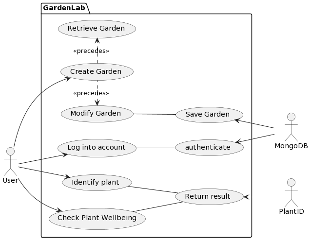
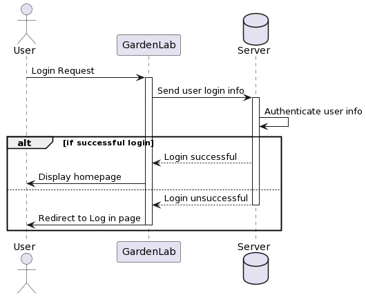
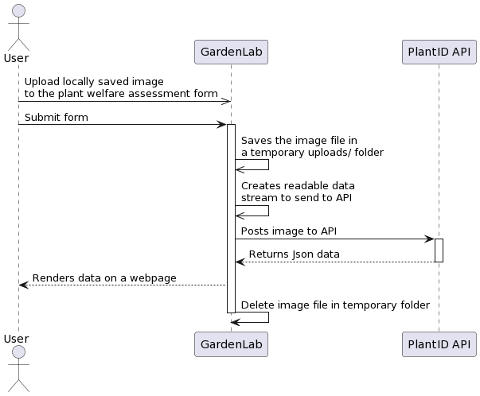
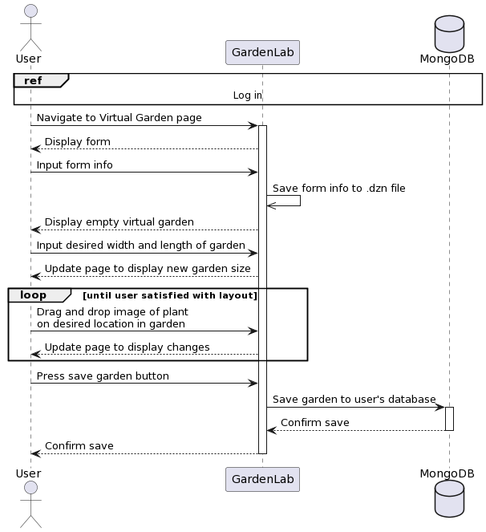
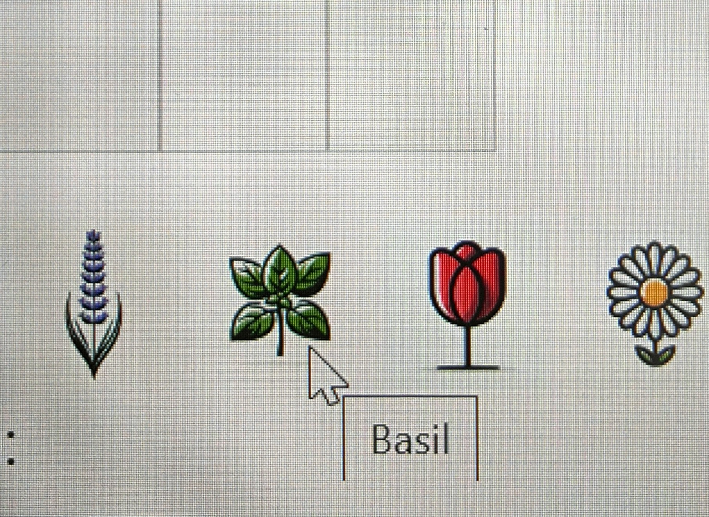

# Technical Specification

**Authors:** Anisa Hoxha - 21413586, Zara Purewal - 21404176

## 0. Table of Contents

- [Technical Specification](#technical-specification)
- [0. Table of Contents](#0-table-of-contents)
- [1. Introduction](#1-introduction)
  - [1.1 Overview](#11-overview)
  - [1.2 Glossary](#12-glossary)
- [2. System Architecture](#2-system-architecture)
- [3. High-Level Design](#3-high-level-design)
  - [3.1 Use case Diagram](#31-use-case-diagram)
  - [3.2 Sequence diagram for logging in](#32-sequence-diagram-for-logging-in)
  - [3.3 Sequence Diagram for Plant Identification Tool](#33-sequence-diagram-for-plant-identification-tool)
  - [3.4 Sequence Diagram for Plant Welfare Assessment Tool](#34-sequence-diagram-for-plant-welfare-assessment-tool)
  - [3.5 Sequence Diagram for Creating Virtual Garden Planner Tool](#35-sequence-diagram-for-creating-virtual-garden-planner-tool)
- [4. Problems and Resolution](#4-problems-and-resolution)
  - [4.1 PlantID does not provide care instructions when identifying plants](#41-plantid-does-not-provide-care-instructions-when-identifying-plants)
  - [4.2 Minizinc not working with node.js](#42-minizinc-not-working-with-nodejs)
- [5. Testing and Validation](#5-testing-and-validation)
  - [5.1 User testing (us)](#51-user-testing-us)
  - [5.2 Machine learning threshold validation](#52-machine-learning-threshold-validation)
  - [5.3 MiniZinc Satisfiability Validation](#53-minizinc-satisfiability-validation)
  - [5.4 Form validation](#54-form-validation)
  - [5.5 Login session cookie testing](#55-login-session-cookie-testing)
  - [5.6 Unit Testing](#56-unit-testing)
- [6. Design](#6-design)
  - [6.1 Garden Planner UI:](#61-garden-planner-ui)
  - [6.2 Consistent Design:](#62-consistent-design)
  - [6.3 CSS and Bootstrap:](#63-css-and-bootstrap)
  - [6.4 Intuitive Design:](#64-intuitive-design)
- [7. Installation Guide](#7-installation-guide)
  - [Prerequisites:](#prerequisites)
- [7. Resources](#7-resources)
  - [7.1 Learning Resources](#71-learning-resources)
  - [7.2 Referential Resources](#72-referential-resources)
- [8. Appendices](#8-appendices)
  - [Code for plantuml diagrams](#code-for-plantuml-diagrams)
    - [Use case Diagram](#use-case-diagram)
    - [Login sequence diagram](#login-sequence-diagram)
    - [For plant identification tool](#for-plant-identification-tool)
    - [For plant welfare assessment tool](#for-plant-welfare-assessment-tool)
    - [Sequence diagram for creating virtual garden](#sequence-diagram-for-creating-virtual-garden)

## 1. Introduction

### 1.1 Overview

GardenLab is a garden planning assistance website. It has three main features; A virtual garden planner, a plant identification section, and a plant health assessment section.
The virtual garden planner requires users to choose the width and length of their garden, and then drag and drop images of plants onto the garden grid to represent where they want the plant to go. The dimension of the garden is relative to inputted width and height.
The plant identification and the plant assessment sections work in a similar fashion. Users can upload an image of a plant that they have saved locally, to either identify the plant or assess the health of the plant.
Plant identification returns images of similar plants, name of similar plants and probability that the suggested plant is correct. Users can click on the name of the plant which will bring up a google search that will provide care instructions of the plant.
Plant assessment returns images of possible things wrong with the plant, along with the name of the ailment and a probability that the suggestion is correct. Below each image is a set of treatments ranging from chemical treatment, biological treatments and preventative measures.

### 1.2 Glossary

- **node.js**: A javascript environment used to build our application.
- **express.js**: A node.js web application framework.
- **Constraint satisfaction engine**: A computational tool that efficiently finds solutions to constraint satisfaction problems.
- **MiniZinc**: A constraint satisfaction engine.
- **Multer**: A node.js middleware for handling multipart/form-data.
- **Axios**: A promise-based HTTP Client for node.js and the browser.
- **Dotenv**: A tool for managing environment variables in Node.js projects.
- **MongoDB**: The database used for this project.
- **PlantID API**: A plant and plant diseases machine learning API tool.
- **bycrypt**: A library used to hash passwords.
- **jest**: Testing framework for unit testing.
- **DOM**: Document Object Model.
- **JsDOM**: JavaScript implementation of many web standards.
- **.dzn file**: A data file compatible with MiniZinc.

## 2. System Architecture

The system architecture is composed of three primary components: the GardenLab web app, the GardenLab database, and external APIs (Plant.id API). These components interact with each other to provide a seamless user experience.


## 3. High-Level Design

### 3.1 Use case Diagram


The use case diagram illustrates the interactions between the system and its users, highlighting the key functionalities available.

### 3.1 Sequence diagram for logging in


This sequence diagram shows the process a user goes through to log into the GardenLab app.

### 3.2 Sequence Diagram for Plant Identification Tool


Describes the workflow for identifying a plant using the PlantID API.

### 3.3 Sequence Diagram for Plant Welfare Assessment Tool


Outlines the steps for assessing the health of a plant through the web app.

### 3.4 Sequence Diagram for Creating Virtual Garden Planner Tool


Illustrates the process for creating a virtual garden, including selecting plants and arranging them within a garden plot.

## 4. Problems and Resolution

### 4.1 PlantID does not provide care instructions when identifying plants

A workaround involves directing users to a Google search for care instructions based on the plant name identified.

### 4.2 Minizinc not working with node.js

Due to integration issues with MiniZinc and node.js, a direct solution was not found within the project's timeframe, leading to a simplified virtual garden feature.

## 5. Testing and Validation

### 5.1 User Testing



Focused on ensuring the usability and functionality of the web app through team-based testing.

### 5.2 Machine learning threshold validation

Involved testing the accuracy of the PlantID API's plant identification feature.

### 5.3 MiniZinc Satisfiability Validation

Tested the limitations of the MiniZinc constraint satisfaction engine with the provided garden data.

### 5.4 Form validation

Ensured that user inputs meet specific criteria for registration and login forms.

### 5.5 Login session cookie testing

Tested the persistence of user sessions across different pages of the application.

### 5.6 Unit Testing

Utilized jest for testing individual functions and components of the web app.

## 6. Design

Focused on creating a user-friendly interface with intuitive navigation and consistent design across the platform.

## 7. Installation Guide

### Prerequisites:

- Web browser, stable internet connection, text editor, command-line terminal, Node.js, Git.

## 7. Resources

### 7.1 Learning Resources

The following resources have been used as learning materials over the course of this project

-   <https://www.minizinc.org/doc-2.8.2/en/part_2_tutorial.html> - Tutorial of all major aspects of modelling in MiniZinc, as well as practice exercises.

-   <https://www.youtube.com/playlist?list=PLj8827bRIwAuv2ZEaqaaZxddSXiMb2dML> - a series of online lectures and practice exercises on modelling in MiniZinc

-   <https://www.youtube.com/watch?v=rT1g_hLs_5A> - Online lecture about enumerated types in MiniZinc

<https://people.eng.unimelb.edu.au/pstuckey/papers/cpaior-typex.pdf> - "Enumerated Types and Type Extensions for MiniZinc" - Lecture notes from Monash University, Melbourne, Australia


### 7.2 Referential Resources

The following sources were used as references  for different parts of the project 

-   <https://plant.id/docs> -  API used for Plant Identification Tool and Plant Welfare Assessment Tool.

-   <https://expressjs.com/>  - Used as a reference for routing using the express framework for node.js.

-   <https://copyprogramming.com/howto/how-to-post-form-data-using-axios-in-node>  - Used as a reference when using axios to post form data.

-   <https://expressjs.com/en/resources/middleware/multer.html> - Used as a reference for using multer to process image files in form data when posting to an API.

-   <https://www.mickpatterson.com.au/blog/how-to-use-environment-variables-in-nodejs-with-express-and-dotenv> - Used as a reference for using dotenv to use custom environment variables

-   <https://js.minizinc.dev/docs/stable/modules.html> - Used as a reference for the MiniZinc Javascript module for nodejs

-   <https://github.com/MiniZinc/minizinc-js/blob/develop/types/index.d.ts> - Used as a reference for the MiniZinc Javascript module for nodejs

-   <https://www.tutorialspoint.com/how-to-allow-only-positive-numbers-in-the-input-number-type#:~:text=To%20sum%20it%20up%2C%20the,numbers%20in%20the%20input%20field>. - Only positive numbers allowed in a form, used for virtual garden planner 

-   <https://stackoverflow.com/questions/48808077/staying-logged-in-after-logging-out-with-express-and-mongodb>  - passport and sessions

-   <https://stackoverflow.com/questions/43492717/how-to-keep-user-logged-in-even-after-reloading-the-main-file-index-js> - also passport and sessions

-   <https://www.passportjs.org/concepts/authentication/sessions/> - helpful guide for passport sessions

-   <https://medium.com/geekculture/web-based-multi-screen-apps-including-drag-drop-5e161da6507b>  - Reference for drag and drop functionalities in virtual garden

-   <https://www.mongodb.com/docs/drivers/node/v4.1/>  - step by step guide how to use mongodb with nodejs

-   <https://www.mindbowser.com/login-form-using-node-js-and-mongodb/>  - login form sample

-   <https://www.bezkoder.com/node-js-express-login-mongodb/>  - node with mongo db sample guide

<https://www.geeksforgeeks.org/login-form-using-node-js-and-mongodb/>  - using mongo with passport for form registation

## 8. Appendices

### Code for plantuml diagrams
``` Plantuml Code

---------------------------------------------

Usecase Diagram

@startuml

left to right direction

actor User as user

actor Server as server

actor API as api

actor "Constraint Satisfaction Engine" as cse

package GardenPlanner {

usecase "Log into account" as login

usecase "Create Garden" as creategard

usecase "Generate Garden" as gengard

usecase "Modify Garden" as modgard

usecase "Save Garden" as savegard

usecase "Retrieve Garden" as retrievegard

usecase "Change Garden Status" as statusgard

usecase "Identify plant" as idplant

usecase "Check Plant Wellbeing" as checkplant

usecase "authenticate" as authenticate

usecase "Return result" as returnresults

}

user --\> login

user --\> creategard

user --\> idplant

user --\> checkplant

modgard \<. creategard : \<\<precedes\>\>

creategard .\> retrievegard : \<\<precedes\>\>

creategard .\> statusgard : \<\<precedes\>\>

authenticate \<-- server

login -- authenticate

gengard \<-- cse

creategard -- gengard

savegard \<-- server

creategard -- savegard

modgard -- savegard

returnresults \<-- api

idplant -- returnresults

checkplant -- returnresults

@enduml

----------------------------------------------

Login sequence diagram

@startuml

actor User as user

participant GardenLab as gl

database Server as server

user -\> gl : Login Request

activate gl

gl -\> server : Send user login info

activate server

server -\> server : Authenticate user info

alt if successful login

server --\> gl: Login successful

gl -\> user : Display homepage

else

server --\> gl : Login unsuccessful

deactivate server

gl -\> user : Display error page

deactivate gl

end

@enduml

-----------------------------------------------

Create Garden

@startuml

actor User as user

participant GardenLab as gl

database Server as server

participant "Constraint Satisfaction Engine" as cse

user -\> gl : Request to Create Garden

activate gl

gl -\> cse : Send info

activate cse

alt Valid gaden possible

cse --\> gl : Return Generated Garden

gl --\> user : Display garden to user

else Valid garden not possible

cse --\> gl : Return two options for Generated garden

deactivate cse

gl --\> user : Ask user to choose one of the options

user -\> gl : Select desired garden

gl --\> user : Display garden to user

end

loop until user is satisfied with garden

user -\> gl : Modify Garden

gl --\> user : Return modified garden

end

user -\> gl : Save Garden

gl -\> server : Save Garden

deactivate gl

@enduml

---------------------------------------------------

Changing status of garden

@startuml

actor User as user

participant GardenLab as gl

database Server as server

user -\> gl : Request to retrieve virtual garden

activate gl

gl -\> server : Retrieve garden

activate server

server --\> gl : Return garden

deactivate server

gl --\> user : Display garden

alt Changing status of whole garden

user -\> gl : Change whole garden status to real

gl -\> server : Save status as real

else Changing status of part of garden

user -\> gl : Mark section that user wishes to change the status of

user -\> gl : Change status of section to real

gl -\> server : Save section as a new garden and set status to real

deactivate gl

end

@enduml

```
